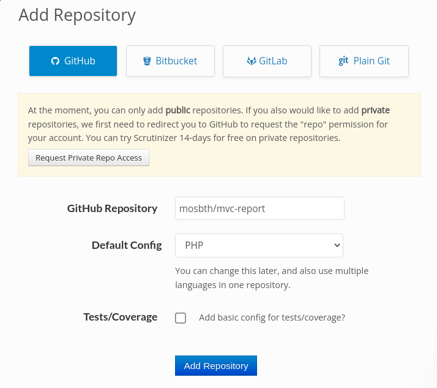
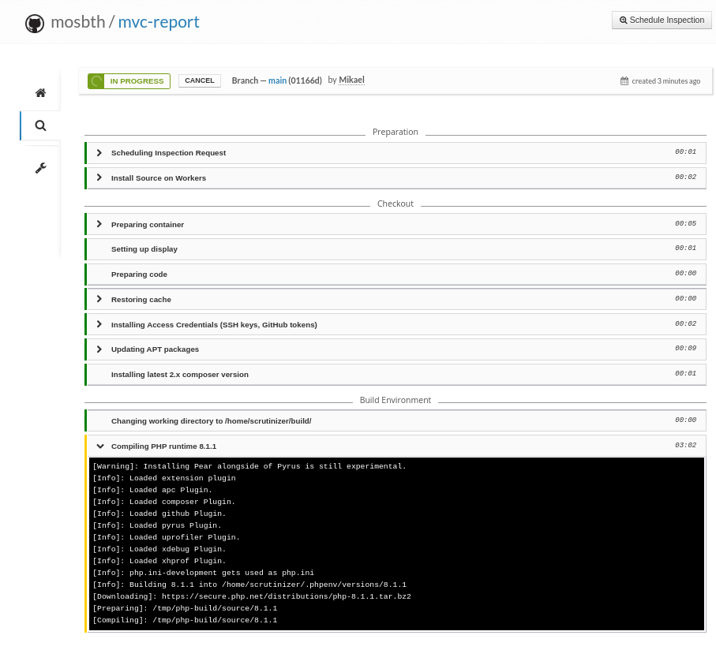
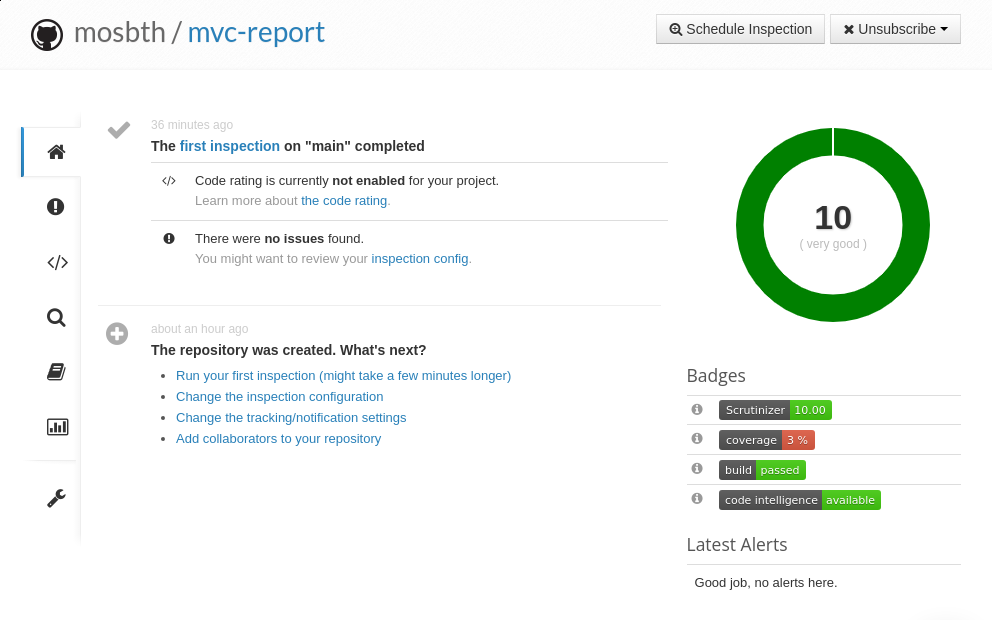

<!--
---
author: mos
revision:
    "2023-05-09": "(B, mos) Reviewed and updated."
    "2022-03-27": "(A, mos) First release."
---


-->

Integrate your repo with Scrutinizer
==========================

This exercise will show you how to integrate your git repository with the external build and code inspection service Scrutinizer.

<!--
TODO

* .env.scrutinizer link to the resource to read.
* Update example repo to (8.2) and docs/coverage.clover
-->


The build service Scrutinizer
--------------------------

A continuous integration (CI) service like [Scrutinizer](https://scrutinizer-ci.com/) will check out your code on every update of your GitHub/GitLab repo and it will then execute your test suite and analyze your code. As a result, you can get a few badges showing the status of your code.

Here are badges from a set of example projects. Can you say something about the code quality by just looking at the badges?

[](https://scrutinizer-ci.com/g/canax/router/build-status/master) [](https://scrutinizer-ci.com/g/canax/router/?branch=master) [](https://scrutinizer-ci.com/g/canax/router/?branch=master)

[](https://scrutinizer-ci.com/g/canax/database/build-status/master) [](https://scrutinizer-ci.com/g/canax/database/?branch=master) [](https://scrutinizer-ci.com/g/canax/database/?branch=master)

[](https://scrutinizer-ci.com/g/mosbth/cimage/build-status/master) [](https://scrutinizer-ci.com/g/mosbth/cimage/?branch=master) [](https://scrutinizer-ci.com/g/mosbth/cimage/?branch=master)

You can click on the badges to view the details for the projects.


Get a Scrutinizer account
--------------------------

You need to create an account at the Scrutizer service, you can use your GitHub account to sign up.

The Scrutinizer service provides free builds for open source projects so it will be free of charge to use it.


Prepare your repo
--------------------------

Fulfill the following requirements to prepare your repo to be connected to the Scrutinizer build service.

You have a public repo at GitHub/GitLab.

In your repo, you can do the following tasks through composer (or by running the command directly).

```
# Lint and mess detector
composer phpmd
composer phpstan

# Unit testing generates a build/coverage.clover
composer phpunit
```

You should ensure that phpmd and phpstan pass before you connect your repo with Scrutinizer. That will help you get the best results from Scrutinizer.

You should also ensure that the unit tests pass and the coverage file is generated.

```
# Unit testing generates a docs/coverage.clover
composer phpunit
```

Ensure that the file `docs/coverage.clover` is generated.

Now you are prepared.


Configuration file `.scrutinizer.yml`
--------------------------

Now you add a configuration file for Scrutinizer to your repo. This [`.scrutinizer.yml`](.scrutinizer.yml) will decide what Scrutinizer will do with your repo.

You can copy the sample configuration file like this.

```
# You are in the root of the course repo
cp example/scrutinizer/.scrutinizer.yml me/report

# You are in the me/report directory
cp ../../example/scrutinizer/.scrutinizer.yml .
```

You should open the configuration file and inspect it in your text editor.

Some parts of your repo can be ignored by configuring `excluded_paths`.

The example configuration file will not run your linters since `tools/` are not part of the repo. Scrutinizer has its own set of linters that will be run to analyze the code.

The example configuration file will run your test suite using the command `composer phpunit`.

You can read more on the [Scrutinizer configuration file for PHP](https://scrutinizer-ci.com/docs/guides/php/continuous-integration-deployment).

The format of the configuration file is [YAML](https://en.wikipedia.org/wiki/YAML).

You can provide a `.env.scrutinizer` if you want a specific setup for the Scrutinizer tests. That way you can set up different settings for the database depending on its environment.


Connect the repo to Scrutinizer
--------------------------

Ensure that you have committed the configuration file `.scrutinizer.yml` to your repo and that you have pushed it to GitHub/GitLab.

Here is an example repo having the configuration file [`.scrutinizer.yml`](https://github.com/mosbth/mvc-report/blob/main/.scrutinizer.yml).

You can now add a connection to your repo. There is usually a + button on the top right of the page to "add a repository" at the Scrutinizer web.

If my repo is `https://github.com/mosbth/mvc-report` then it can look like this when you add that repo.



If it all works out, then Scrutinizer will start its first build. You can follow the status of the build as it proceeds.




The first (or latest) build
--------------------------

If everything is green you will have the report from your first build available to inspect. Scrutinizer prepares a lot of details from analyzing your code. Check out the results for your code and check if you can see some quality metrics.

You can inspect the [latest build of my example project](https://scrutinizer-ci.com/g/mosbth/mvc-report/).

If your build fails, then check out the output from the build and try to find out what happened. You will usually get some verbose error message on what went wrong.

Try to fix the error and do a new commit. You can manually start (Schedule Inspection) a build on the Scrutinizer landing page for your project.

This is how it can look when it passes the first build.




Get the badges
--------------------------

You should now get the badges for build status, code coverage and code quality and add them to the `README.md` of your project. Click the info button next to the badge to get the Markdown code to use in your README to display the badge.

You can see [my example project README.md](https://github.com/mosbth/mvc-report/blob/main/README.md) how it can look like.

These are the current badges from my example project.

[](https://scrutinizer-ci.com/g/mosbth/mvc-report/build-status/main) [](https://scrutinizer-ci.com/g/mosbth/mvc-report/?branch=main) [](https://scrutinizer-ci.com/g/mosbth/mvc-report/?branch=main)

You can click on the badges to reach the reports on Scrutinizer.
